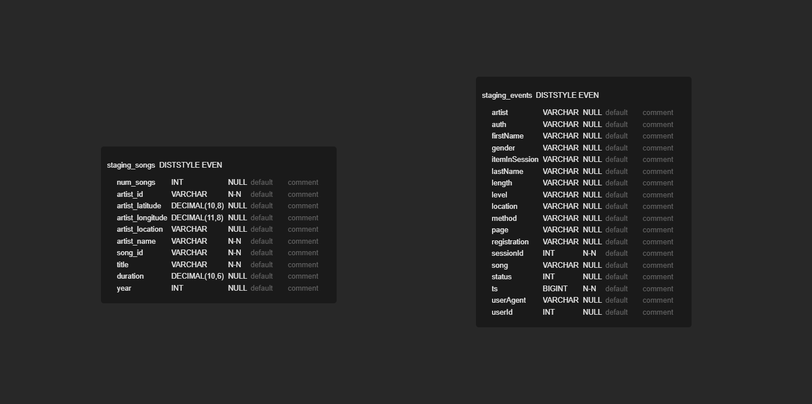
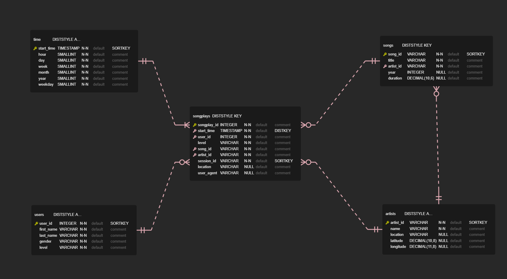

# Project 3: Data Warehouse

## Introduction

Sparkify, a music streaming startup, has grown their user base and song database. In order to cope with the increasing load, they have decided to process the data in the cloud. Their data resides in S3, in a directory of JSON logs on user activity on the app, as well as a directory with JSON metadate on the songs in their app.

## Goal

The goal of this project is to build an ETL pipeline that extracts their data from S3, stage them in Redshift, and transform the data into a set of dimensional tables for their analytics team to continue finding insights in what songs their users are listening to.

## Source Data

There are two datasets that reside in S3.

- Song data: `s3://udacity-dend/song_data`
    - Number of files: 14'896
    - Each file contains one record
- Log data: `s3://udacity-dend/log_data`
    - Number of files: 30
    - Each files contains multiple JSON objects that represent a record, separated by a newline.
    
Also there is a JSON path file provided which defines the data mapping of the log data: `s3://udacity-dend/log_json_path.json`

### Song Dataset

The song dataset is partitioned by the first three letters of each song's track ID. For example:

```
song_data/A/B/C/TRABCEI128F424C983.json
song_data/A/A/B/TRAABJL12903CDCF1A.json
```

The content of a song dataset looks like this:

```json
{"num_songs": 1, "artist_id": "ARJIE2Y1187B994AB7", "artist_latitude": null, "artist_longitude": null, "artist_location": "", "artist_name": "Line Renaud", "song_id": "SOUPIRU12A6D4FA1E1", "title": "Der Kleine Dompfaff", "duration": 152.92036, "year": 0}
```

### Log Dataset

Log datasets are partitioned by year and month:

```
log_data/2018/11/2018-11-12-events.json
log_data/2018/11/2018-11-13-events.json
```

Here is a screenshot of a log file:


## Data Model

The data model will be created on AWS Redshift and consists of a set of staging tables and a star schema with a fact and dimensional tables. The initial load will be loading the two datasets from S3, songs and logs, to their respective staging tables `staging_songs` and `staging_events`.

Once the load finishes, the data will be transformed and loaded into the star schema tables.

### Staging Tables

The first step of the ETL process is to extract the source data from S3 and load them into staging tables. The purpose of staging tables is to push down the transformation on the same cluster to avoid data shuffling.



#### Table: staging_songs

The songs dataset from S3 will be loaded into this table. As of today, the dataset includes 14'896 records.

#### Table: staging_events

The log datasets from S3 on the other hand will loaded into this table. Since a log file contains multiple JSON objects, we need to refer to a path file while loading the data into this table. The path file can be retrieved here: `s3://udacity-dend/log_json_path.json`

### Star Schema

To support the analytics team of Sparkify, we need to transform the data into a star schema. This schema provides a more intuitive interface for people doing analytics and allows them to gain insights very quickly.



#### Table: songplays

The only fact table in this star schema. This table contains measures such as songs and artists listened. The facts can be grouped by the dimensions user, date, etc. Only the log data containing `page='NextSong'` will loaded into this table, as other events such as 'Login' are not relevant to perform the analysis. In order to add `artist_id` and `song_id`, a lookup to the `staging_songs` table is necessary.

#### Table: time

Timestamps from the `staging_events` table will be converted into a datetime format. Other components of a date will be derived from the timestamp as well and stored into this table to allow more options to filter by date.

#### Table: users

Every unique user retrieved from the `staging_events` table will be stored here. Only the most recent entry of a particular user will be considered to provide the most up-to-date information.

#### Table: artists

Every unique artist from the `staging_songs` table will be loaded into this table.

#### Table: songs

Every unique song from the `staging_songs` table will be loaded into this table.

## Project Structure

This project is based on five files, which will be shortly described in this section.

**dwh.cfg.template**
<br>
Rename this file to `dwh.cfg` and fill in the information. If you wish to deploy the services using the `data_warehouse.ipynb`, then add your IAM user key and secret otherwise leave it empty.
> If you provided your key and secret, make sure not to publish them!

**data_warehouse.ipynb**
<br>
This notebook describes all the steps that are required to deploy a Redshift cluster using the Boto3 library for Python. It does also provide a sandbox to test your queries.

**sql_queries.py**
<br>
All the DDL and DML required for the data warehouse are stored in this script. This script is required to run the `create_tables.py` and `etl.py` scripts.

**create_tables.py**
<br>
This script will create the staging and star schema tables in the Redshift cluster as defined in the `dwh.cfg` file. The script has dependencies to the `sql_query.py` script.

**etl.py**
<br>
Once the tables have been created, you can run this script to start the ETL process. The script will start by loading S3 data to the staging tables. Finally, this script will transform the data and load them into the star schema tables. The script has dependencies to the `sql_query.py` script.

## Usage

### Prerequisites

There are two options:

- You can either provision the following processes using AWS Management Console:
    - Redshift Cluster
    - Create and attach IAM Role with S3 read access to Redshift
    - Modify Redshift security group to allow inbound access from anywhere
- Or you can use the notebook `data_warehouse.ipynb` to provision the mentioned services. In order to do this, you must create:
    - An IAM user with programmatic access that has privileges to create Redshift, create IAM roles, and modify security groups
    - Add the key and secret of this IAM user to `dwh.cfg`
    
### Running the Scripts

When the requirements have been fulfilled, you have to run these two scripts in order:

```bash
python create_tables.py
python etl.py
```

## Example Queries

### Query 1: Get Top 5 Users by Songplays

Query:
```sql
SELECT sp.user_id
            ,u.first_name
            ,u.last_name
            ,u.level
            ,COUNT(*) AS songplays
            ,COUNT(DISTINCT session_id) AS sessions
FROM songplays sp
JOIN users u ON sp.user_id = u.user_id
GROUP BY 1, 2, 3, 4
ORDER BY songplays DESC
LIMIT 5;
```

Output:

user_id | first_name | last_name | level | songplays | sessions
---: | ---: | ---: | ---: | ---: | ---:
49 | Chloe | Cuevas | paid | 42 | 21 
97 | Kate | Harrell | paid | 32 | 11 
80 | Tegan | Levine | paid | 31 | 17 
44 | Aleena | Kirby | paid | 21 | 7 
73 | Jacob | Klein | paid | 18 | 6 

### Query 2: Get Top 5 Most Listened Songs

Query:
```sql
SELECT s.title AS song_title
            ,a.name AS artist_name
            ,COUNT(*) AS songplays
FROM songplays sp
JOIN songs s ON sp.song_id = s.song_id
JOIN artists a ON sp.artist_id = a.artist_id
GROUP BY 1, 2
ORDER BY songplays DESC
LIMIT 5;
```

Output

song_title | artist_name | songplays
---: | ---: | ---:
You're The One | Dwight Yoakam | 37
Catch You Baby (Steve Pitron & Max Sanna Radio Edit) | Lonnie Gordon | 9
I CAN'T GET STARTED | Ron Carter | 9
Nothin' On You [feat. Bruno Mars] (Album Version) | B.o.B | 8
Hey Daddy (Daddy's Home) | Usher featuring Jermaine Dupri | 6